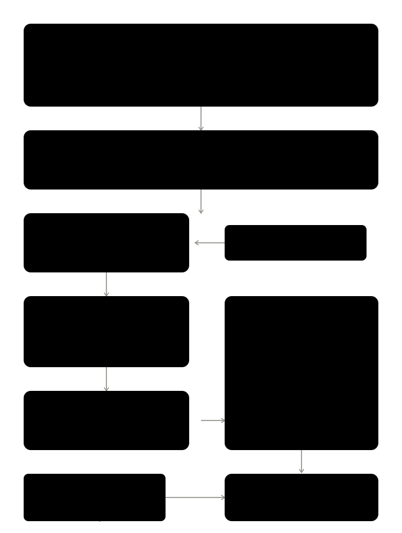

# 🗺️ Criminalidad España - Visualización Interactiva

Aplicación web para la visualización interactiva de datos de criminalidad en España con soporte multi-nivel (Nacional, CCAA, Provincias, Municipios).

**🌐 Demo en producción:** https://delitos.hookponent.cc

---

## 📋 Características

### ✅ Versión 2.1 - Actual

- **Visualización multi-nivel:** Nacional, Comunidades Autónomas, Provincias y Municipios
- **Filtros dinámicos:** Periodo (2015-2025) y Tipo de delito cargados desde API
- **Mapa interactivo:** Colores dinámicos basados en percentiles calculados por nivel
- **Leyenda adaptativa:** Umbrales actualizados automáticamente según filtros
- **Leyenda colapsable:** Expandible/contraíble en todas las plataformas
- **Panel de información:** Datos detallados al hacer hover/click en regiones
- **Página de comparativa:** Gráficos de evolución temporal con Chart.js
- **Comparación entre regiones:** Selecciona hasta 2 ubicaciones para comparar
- **Tooltips interactivos:** Toca un punto del gráfico para ver detalles (móvil-friendly)
- **Navegación entre vistas:** Botones para alternar entre Mapa y Comparativa
- **Responsive:** Panel lateral en desktop, colapsable superior en móvil
- **Datos actualizados:** Hasta diciembre 2025

---

## 🏗️ Arquitectura

### Backend - FastAPI + PostgreSQL

```
backend/
├── app/
│   ├── main.py          # Aplicación FastAPI principal
│   ├── database.py      # Conexión PostgreSQL
│   └── routes/
│       └── mapa.py      # Endpoints de datos geográficos
└── requirements.txt
```

**Endpoints principales:**
- `GET /api/mapa/periodos` - Lista de periodos disponibles
- `GET /api/mapa/tipologias` - Tipos de delitos disponibles
- `GET /api/mapa/delitos/agregado/{nivel}` - Datos agregados por nivel geográfico
- `GET /api/mapa/delitos/evolucion/{nivel}` - Evolución temporal para comparativas

### Frontend - Leaflet.js + Chart.js + HTML5 nativo

```
frontend/
├── index.html           # Página del mapa interactivo
├── comparativa.html     # Página de comparación con gráficos
└── static/
    └── js/
        ├── app.js           # Lógica del mapa
        └── comparativa.js   # Lógica de gráficos

data/
└── mapas/               # GeoJSON files (generados desde CNIG)
    ├── comunidades.geojson
    ├── provincias.geojson
    └── municipios.geojson

scripts/
└── procesar_mapas.py    # Script para generar GeoJSON desde shapefiles CNIG
```

---

## 🚀 Instalación y Configuración

### Requisitos previos

- Python 3.8+
- PostgreSQL 13+
- Datos de criminalidad cargados en PostgreSQL

### 1. Clonar repositorio

```bash
git clone https://github.com/sergiovelayos/delitos.git
cd delitos
```

### 2. Configurar backend

```bash
cd backend
python -m venv .venv
source .venv/bin/activate  # En Windows: .venv\Scripts\activate
pip install -r requirements.txt
```

### 3. Variables de entorno

Crear `.env` en la raíz:

```bash
PG_USER=tu_usuario
PG_PASSWORD=tu_contraseña
PG_HOST=localhost
PG_PORT=5432
PG_DATABASE=criminalidad
```

### 4. Ejecutar localmente

```bash
# Backend
cd backend
uvicorn app.main:app --reload --host 0.0.0.0 --port 8001

# Frontend (servir archivos estáticos)
cd frontend
python -m http.server 8000
```

Acceder a: http://localhost:8000

---

## 🔧 Despliegue en Producción

### Servicio systemd

Crear `/etc/systemd/system/criminalidad.service`:

```ini
[Unit]
Description=Criminalidad España - FastAPI Application
After=network.target postgresql.service

[Service]
Type=simple
User=tu_usuario
WorkingDirectory=/ruta/a/criminalidad_app/backend
Environment="PATH=/ruta/a/criminalidad_app/.venv/bin"
ExecStart=/ruta/a/criminalidad_app/.venv/bin/uvicorn app.main:app --host 0.0.0.0 --port 8001
Restart=always
RestartSec=10

[Install]
WantedBy=multi-user.target
```

```bash
sudo systemctl daemon-reload
sudo systemctl enable criminalidad
sudo systemctl start criminalidad
```

### Cloudflare Tunnel (Recomendado)

Configuración en `/etc/cloudflared/config.yml`:

```yaml
tunnel: tu-tunnel-id
credentials-file: /ruta/a/credentials.json

ingress:
  - hostname: delitos.tudominio.com
    service: http://127.0.0.1:8001
  - service: http_status:404
```

---

## 🛠️ Resolución de Problemas Técnicos

### Problema 1: Dropdowns no se llenaban en móvil

**Causa:** `DOMContentLoaded` se ejecutaba antes de que los elementos `<select>` existieran en el DOM.

**Solución:**
- Consolidar todos los event listeners en un único `DOMContentLoaded`
- Añadir verificaciones `if (element)` antes de manipular elementos
- Usar `<details>` HTML5 nativo en lugar de JavaScript para el menú colapsable

```javascript
document.addEventListener('DOMContentLoaded', function() {
    init();  // Inicializa toda la app cuando el DOM está listo
});
```

### Problema 2: Filtros no actualizaban el mapa

**Causa:** La función `cargarDatos()` aceptaba parámetros pero usaba constantes fijas.

**Solución antes:**
```javascript
async function cargarDatos(nivel, periodo, tipologia) {
    let url = `${API_URL}/api/mapa/delitos/agregado/${NIVEL}?periodo=${PERIODO}`;
    // ❌ Usaba NIVEL, PERIODO, TIPOLOGIA (constantes)
}
```

**Solución después:**
```javascript
async function cargarDatos(nivel, periodo, tipologia) {
    let url = `${API_URL}/api/mapa/delitos/agregado/${nivel}?periodo=${periodo}`;
    // ✅ Usa los parámetros recibidos
    if (tipologia) {
        url += `&tipologia=${encodeURIComponent(tipologia)}`;
    }
}
```

### Problema 3: Panel de información no coincidía con datos filtrados

**Causa:** La función `updateInfoPanel()` solo buscaba en el diccionario `nombresCCAA`, que no funcionaba para provincias/municipios.

**Solución:**
```javascript
function updateInfoPanel(props) {
    const nombreGeoJSON = props.NAMEUNIT;
    
    // Primero intentar diccionario CCAA
    let clave = nombresCCAA[nombreGeoJSON];
    let datos = datosDelitos[clave];
    
    // Si no encuentra, buscar por nombre directo
    if (!datos) {
        const nombreBusqueda = nombreGeoJSON.toUpperCase();
        datos = datosDelitos[nombreBusqueda];
        
        // Si aún no encuentra, buscar por coincidencia parcial
        if (!datos) {
            Object.keys(datosDelitos).forEach(key => {
                if (key.includes(nombreBusqueda)) {
                    datos = datosDelitos[key];
                }
            });
        }
    }
    // ... mostrar datos
}
```

### Problema 4: Incompatibilidad con Safari/Brave móvil

**Causa:** Eventos `click` no se disparaban correctamente en iOS.

**Solución:** Usar elementos HTML5 nativos (`<details>` y `<summary>`) en lugar de JavaScript:

```html
<details class="filtros-details" open>
    <summary class="filtros-summary">
        <h2>Filtros</h2>
        <span class="toggle-arrow">▼</span>
    </summary>
    <div class="filtros-content">
        <!-- Contenido -->
    </div>
</details>
```

**CSS para desktop vs móvil:**
```css
/* Desktop: Siempre abierto */
@media (min-width: 769px) {
    .filtros-summary {
        display: none;
    }
}

/* Móvil: Colapsable nativo */
@media (max-width: 768px) {
    .filtros-summary {
        display: flex;
    }
}
```

### Problema 5: Caché del navegador no actualizaba JavaScript

**Causa:** El navegador cachea agresivamente los archivos `.js`.

**Solución:** Versionado de archivos estáticos:

```html
<!-- Incrementar versión en cada deploy -->
<script src="/static/js/app.js?v=5"></script>
```

### Problema 6: Normalización de claves entre API y GeoJSON

**Causa:** La API devuelve claves como `"CCAA 01 Andalucía"` pero necesitamos `"ANDALUCÍA"` para hacer match con GeoJSON.

**Solución:** Procesamiento diferenciado por nivel:

```javascript
data.datos.forEach(item => {
    let clave;
    
    if (nivel === 'ccaa') {
        clave = item.geo.replace(/^CCAA \d+ /, '').toUpperCase();
    } else if (nivel === 'provincia') {
        clave = item.geo.replace(/^Provincia \d+ /, '').toUpperCase();
    } else if (nivel === 'municipio') {
        clave = item.geo.replace(/^\d+ /, '').toUpperCase();
    }
    
    datosMap[clave] = item;
});
```

---

## 📊 Fuente de Datos

Los datos provienen de los **Balances Trimestrales de Criminalidad** publicados por el Ministerio del Interior de España a través del Sistema Estadístico de Criminalidad (SEC).

**Fuente oficial:** https://estadisticasdecriminalidad.ses.mir.es/publico/portalestadistico/balances

**Periodo disponible:** 2015 - Diciembre 2025

**Cobertura geográfica:**
- Municipios con más de 20.000 habitantes
- 52 provincias
- 19 Comunidades y Ciudades Autónomas
- Nivel nacional

**Origen de los datos:** Policía Nacional, Guardia Civil, policías autonómicas y policías locales que reportan al SEC.

---

## 📝 Metodología y Tratamiento de Datos

### Problemática de los datos originales

Los datos publicados por el Ministerio presentan dos retos principales:

1. **Formato acumulado:** Las cifras son acumulativas por trimestre, lo que dificulta ver la evolución real periodo a periodo
2. **Varianza poblacional:** La comparación directa entre territorios de tamaños muy diferentes no es significativa

### Transformaciones aplicadas

Para resolver estos problemas se han aplicado las siguientes transformaciones:

- **Desagregación trimestral:** Cálculo matemático para obtener cifras por trimestre individual (restando el acumulado del trimestre anterior)
- **Normalización por población:** Cruce con datos del INE para calcular tasas por cada 1.000 habitantes

### Diagrama de transformación de datos



### Proceso de limpieza y enriquecimiento

| Paso | Descripción |
|------|-------------|
| **Estandarización** | Conversión de cifras a enteros y fechas a formato estándar |
| **Unificación de categorías** | Consolidación de delitos idénticos con nomenclatura variable entre periodos |
| **Eliminación de duplicados** | Detección y corrección de entradas redundantes o erróneas |
| **Integración de población** | Asignación de datos censales del INE por municipio, provincia y año |
| **Desagregación trimestral** | Extracción de cifras individuales por trimestre |
| **Cálculo de tasas** | Aplicación de fórmula: (delitos trimestrales / población) × 1.000 |

### Evolución de la estructura de datos

El Ministerio ha ampliado progresivamente su cobertura:

| Año | Geografías | Tipologías | Registros/trimestre |
|-----|------------|------------|---------------------|
| 2016 | 221 | 8 | ~5.300 |
| 2017 | 320+ | 14 | ~13.500 |
| 2021 | 489 | 14 | ~22.000 |
| 2023+ | ~500 | 19 | ~28.000 |

---

## 🔢 Clasificación de Delitos

### Criminalidad Convencional

| Categoría | Descripción |
|-----------|-------------|
| **Homicidios** | Homicidios dolosos y asesinatos consumados e intentados |
| **Delitos sexuales** | Agresiones sexuales con penetración y otros delitos contra la libertad sexual |
| **Robos con violencia** | Robos con violencia e intimidación |
| **Robos con fuerza** | En domicilios, establecimientos y otros |
| **Hurtos** | Sustracciones sin fuerza ni violencia |
| **Vehículos** | Sustracción de vehículos a motor |
| **Tráfico de drogas** | Delitos relacionados con estupefacientes |
| **Otras infracciones** | Resto de infracciones penales convencionales |

### Cibercriminalidad (desde 2022)

| Categoría | Descripción |
|-----------|-------------|
| **Estafas informáticas** | Fraudes online y phishing |
| **Otros ciberdelitos** | Suplantación de identidad, hacking, propiedad intelectual, delitos sexuales online |

Todas las categorías se agregan en **Total Criminalidad** (infracciones penales totales).

---

## 👥 Datos de Población

Los datos de población provienen del **Instituto Nacional de Estadística (INE)** a través del Censo anual de población.

**Fuente oficial:** [Censo anual de población 2021-2025](https://www.ine.es/jaxiT3/Datos.htm?t=68065) - Población según municipio y sexo

**Cobertura:**
- **Periodo:** 2021 - 2025
- **Desglose:** Por municipio, año y sexo (Total, Hombres, Mujeres)
- **Registros:** 121.971 registros de población
- **Municipios:** 8.132 municipios de España

**Tablas de diccionario geográfico:**
| Tabla | Registros | Descripción |
|-------|-----------|-------------|
| `comunidades` | 19 | Comunidades y Ciudades Autónomas (ID INE y nombre) |
| `provincias` | 52 | Provincias vinculadas a su CCAA |
| `municipios` | 8.132 | Municipios con ID único de 5 dígitos (CPRO + CMUN) |
| `poblacion` | 121.971 | Población por municipio, año (2021-2025) y sexo |

**Nota:** El código de municipio de 5 dígitos sigue el estándar INE (código de provincia + código de municipio) para facilitar el cruce con otros conjuntos de datos oficiales.

### Actualización de población para nuevos años

Cuando haya nuevos datos de población (ej: 2026) y datos de criminalidad del mismo año, seguir este proceso:

**1. Descargar datos del INE:**
   - Ir a [INE - Censo anual de población](https://www.ine.es/jaxiT3/Datos.htm?t=68065)
   - Descargar CSV con población por municipio y sexo para el nuevo año

**2. Importar a la tabla `poblacion`:**
```sql
-- Insertar nuevos registros de población
INSERT INTO poblacion (municipio_id, anio, sexo, valor)
VALUES ('01001', 2026, 'Total', 2980),
       ('01001', 2026, 'Hombres', 1490),
       -- ... resto de municipios
```

**3. Actualizar población en `delitos_aux`:**

Ejecutar las siguientes queries SQL para propagar la población a todos los niveles:

```sql
-- Actualizar MUNICIPIOS (geo empieza con número)
UPDATE delitos_aux da
SET pob = p.valor
FROM poblacion p
WHERE da.geo ~ '^[0-9]'
  AND EXTRACT(YEAR FROM da.periodo) = 2026
  AND p.municipio_id = SUBSTRING(da.geo FROM 1 FOR 5)
  AND p.anio = 2026
  AND p.sexo = 'Total';

-- Actualizar PROVINCIAS (agregar municipios por provincia)
UPDATE delitos_aux da
SET pob = pob_prov.total_pob
FROM (
    SELECT m.provincia_id, SUM(p.valor) as total_pob
    FROM poblacion p
    JOIN municipios m ON p.municipio_id = m.id
    WHERE p.sexo = 'Total' AND p.anio = 2026
    GROUP BY m.provincia_id
) pob_prov
WHERE da.geo LIKE 'Provincia%'
  AND EXTRACT(YEAR FROM da.periodo) = 2026
  AND pob_prov.provincia_id = SUBSTRING(da.geo FROM 11 FOR 2);

-- Actualizar CCAA (agregar municipios por comunidad)
UPDATE delitos_aux da
SET pob = pob_ccaa.total_pob
FROM (
    SELECT m.comunidad_id, SUM(p.valor) as total_pob
    FROM poblacion p
    JOIN municipios m ON p.municipio_id = m.id
    WHERE p.sexo = 'Total' AND p.anio = 2026
    GROUP BY m.comunidad_id
) pob_ccaa
WHERE da.geo LIKE 'CCAA%'
  AND EXTRACT(YEAR FROM da.periodo) = 2026
  AND pob_ccaa.comunidad_id = SUBSTRING(da.geo FROM 6 FOR 2);

-- Actualizar NACIONAL (suma total)
UPDATE delitos_aux da
SET pob = (SELECT SUM(valor) FROM poblacion WHERE sexo = 'Total' AND anio = 2026)
WHERE da.geo = 'NACIONAL'
  AND EXTRACT(YEAR FROM da.periodo) = 2026;
```

**4. Verificar actualización:**
```sql
-- Comprobar población nacional 2026
SELECT geo, periodo, pob
FROM delitos_aux
WHERE geo = 'NACIONAL'
  AND EXTRACT(YEAR FROM periodo) = 2026
  AND tipo = 'Total Criminalidad';
```

---

## 🗺️ Datos Geográficos (GeoJSON)

Los archivos GeoJSON para visualizar los mapas se obtienen del **Centro Nacional de Información Geográfica (CNIG)** del Instituto Geográfico Nacional (IGN).

### Fuente oficial

**Centro de Descargas CNIG:** https://centrodedescargas.cnig.es/CentroDescargas/limites-municipales-provinciales-autonomicos

### Límites municipales, provinciales y autonómicos

Esta geometría responde a la interpretación de los títulos jurídicos inscritos en el Registro Central de Cartografía (RCC): actas de línea límite, resoluciones administrativas, sentencias judiciales. Algunos tramos de líneas pueden ser "provisionales" al carecer de título jurídico que avale su geometría. Estas geometrías tienen una incertidumbre de unos 40 m, consecuencia de las precisiones de las mediciones de la época del levantamiento, trazados sobre el mapa y la posterior digitalización, con excepción de aquellas líneas en las que se han desarrollado una serie de trabajos técnicos y administrativos que han permitido la inscripción de una geometría más precisa.

**Sistema de Referencia Geodésico:** ETRS89 en la península, Illes Balears, Ceuta y Melilla, y REGCAN95 en Canarias (ambos sistemas compatibles con WGS84).

**Formato original:** Shapefile (.shp) y GML.

**[Enlace descarga](https://centrodedescargas.cnig.es/CentroDescargas/detalleArchivo?sec=9000029#)**

### Licencia y reconocimiento

El uso de la información de los productos y servicios de datos geográficos definidos en la [Orden FOM/2807/2015](https://www.boe.es/boe/dias/2015/12/26/pdfs/BOE-A-2015-14129.pdf), así como sus derivados, conlleva la aceptación por el usuario de las condiciones generales de dicha orden, concretada en una [licencia de uso](http://www.ign.es/resources/licencia/Condiciones_licenciaUso_IGN.pdf), compatible con **CC-BY 4.0**.

**Atribución (obra derivada):** Obra derivada de BDLJE CC-BY 4.0 [ign.es](https://www.ign.es/)

### Archivos necesarios

El CNIG proporciona los datos separados por zona geográfica:

| Zona | Archivos | Incluye |
|------|----------|---------|
| **Península + Baleares** | `recintos_*_inspire_peninbal_etrs89.shp` | Península, Baleares, Ceuta, Melilla |
| **Canarias** | `recintos_*_inspire_canarias_regcan95.shp` | Las Palmas, Santa Cruz de Tenerife |

**Importante:** Para tener el mapa completo de España (52 provincias) es necesario descargar **ambas** zonas y combinarlas.

### Proceso de generación

1. **Descargar shapefiles del CNIG:**
   ```bash
   # Descargar desde el Centro de Descargas del CNIG:
   # - recintos_autonomicas_inspire_peninbal_etrs89.zip
   # - recintos_autonomicas_inspire_canarias_regcan95.zip
   # - recintos_provinciales_inspire_peninbal_etrs89.zip
   # - recintos_provinciales_inspire_canarias_regcan95.zip
   # - recintos_municipales_inspire_peninbal_etrs89.zip
   # - recintos_municipales_inspire_canarias_regcan95.zip

   # Extraer en carpeta shapefiles/
   unzip *.zip -d shapefiles/
   ```

2. **Instalar dependencias:**
   ```bash
   pip install geopandas pandas shapely
   ```

3. **Ejecutar script de procesamiento:**
   ```bash
   python scripts/procesar_mapas.py \
       --input-dir ./shapefiles \
       --output-dir ./data/mapas
   ```

4. **Resultado:** Se generan 3 archivos GeoJSON optimizados:
   - `comunidades.geojson` - 19 CCAA
   - `provincias.geojson` - 52 provincias (50 + Ceuta + Melilla)
   - `municipios.geojson` - ~8.131 municipios

### Script de procesamiento

El script `scripts/procesar_mapas.py` realiza:

1. **Combinación** de Península+Baleares con Canarias
2. **Reproyección** a WGS84 (EPSG:4326) para compatibilidad con Leaflet
3. **Simplificación** de geometrías para reducir tamaño de archivo
4. **Exportación** a formato GeoJSON

```bash
# Ver ayuda del script
python scripts/procesar_mapas.py --help

# Procesar solo provincias
python scripts/procesar_mapas.py --nivel provincias

# Listar archivos disponibles
python scripts/procesar_mapas.py --listar --input-dir ./shapefiles
```

### Tolerancia de simplificación

| Nivel | Tolerancia | Tamaño aproximado |
|-------|------------|-------------------|
| CCAA | 0.01 | ~50 KB |
| Provincias | 0.005 | ~200 KB |
| Municipios | 0.001 | ~5 MB |

Valores más altos = más simplificación = archivo más pequeño pero menos detalle.

---

## 🔮 Roadmap

### Completado en v2.1
- [x] Gráficos de evolución temporal
- [x] Comparativas entre regiones

### Próximas funcionalidades
- [ ] Exportación de datos (CSV/Excel)
- [ ] Búsqueda de municipios
- [ ] Soporte offline con Service Workers
- [ ] Mapa de calor (heatmap)
- [ ] Análisis de tendencias

---

## 🤝 Contribuir

1. Fork el proyecto
2. Crea una rama (`git checkout -b feature/nueva-funcionalidad`)
3. Commit tus cambios (`git commit -m 'Añadir nueva funcionalidad'`)
4. Push a la rama (`git push origin feature/nueva-funcionalidad`)
5. Abre un Pull Request

---

## 📝 Licencia

Este proyecto es de código abierto. Los datos de criminalidad son propiedad del Ministerio del Interior de España.

---

## 👤 Autor

**Sergio Velayos Fernández**

- LinkedIn: https://www.linkedin.com/in/sergiovelayos/
- GitHub: https://github.com/sergiovelayos

---

## 🙏 Agradecimientos

- Ministerio del Interior de España por los datos públicos
- OpenStreetMap por los mapas base
- Leaflet.js por la biblioteca de mapas
- Chart.js por la biblioteca de gráficos
- FastAPI por el framework backend
